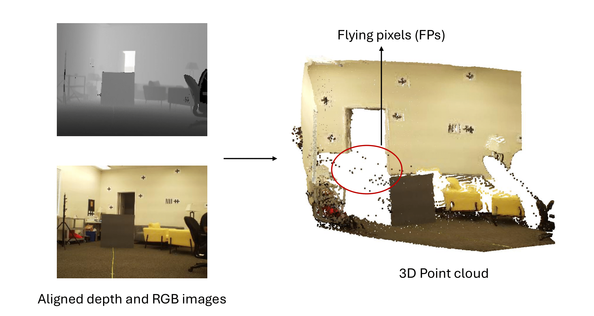
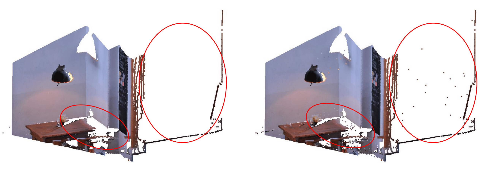
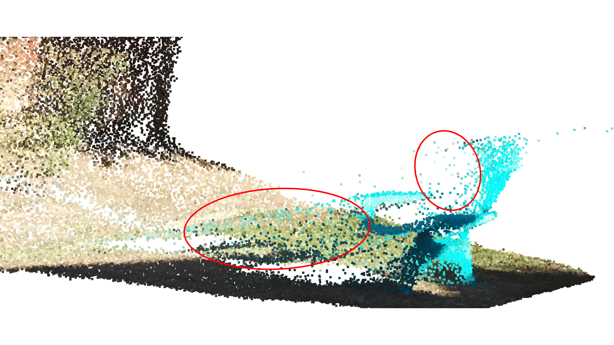
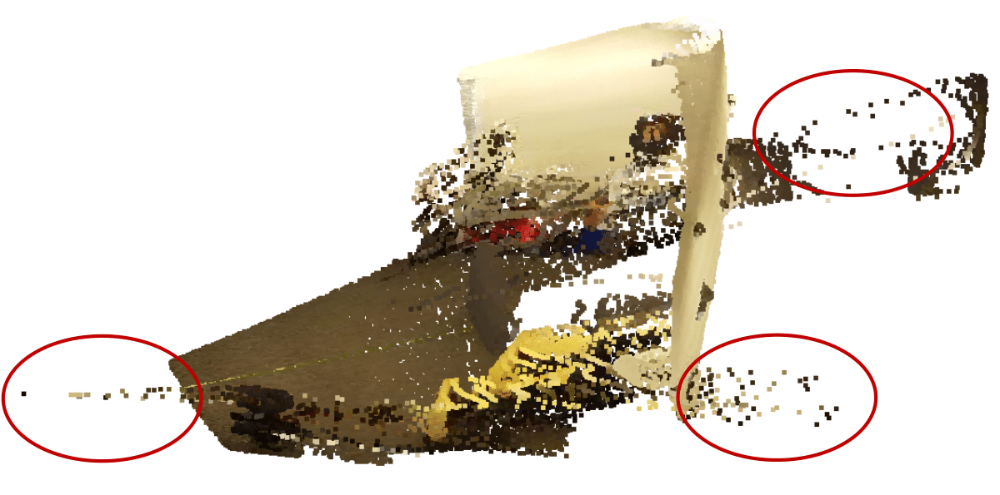
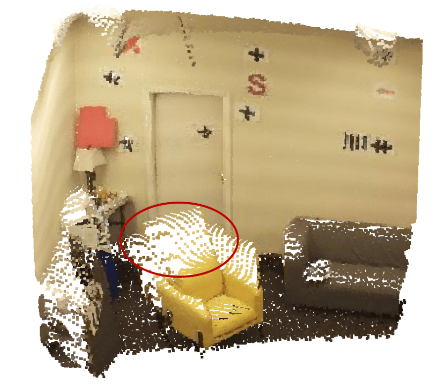
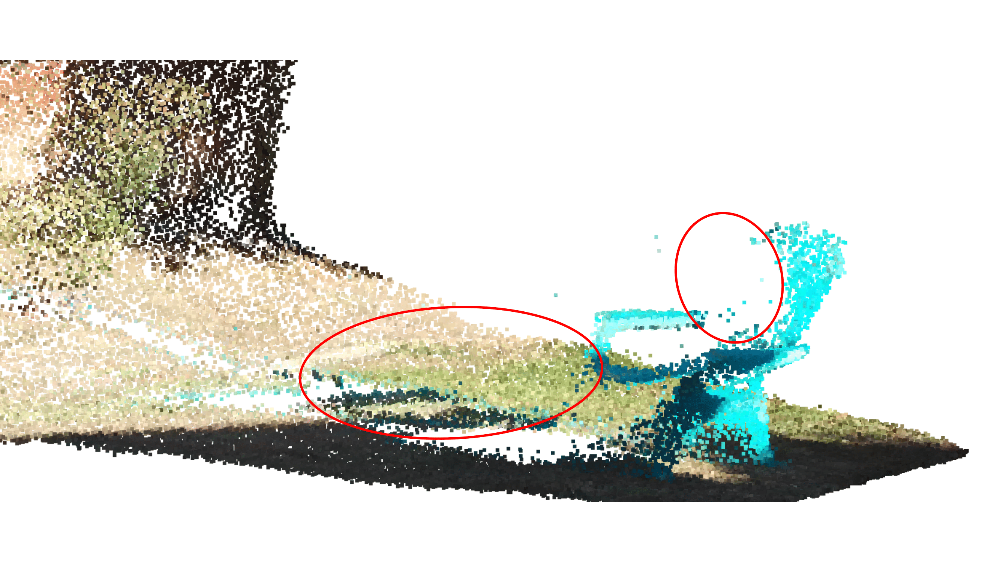
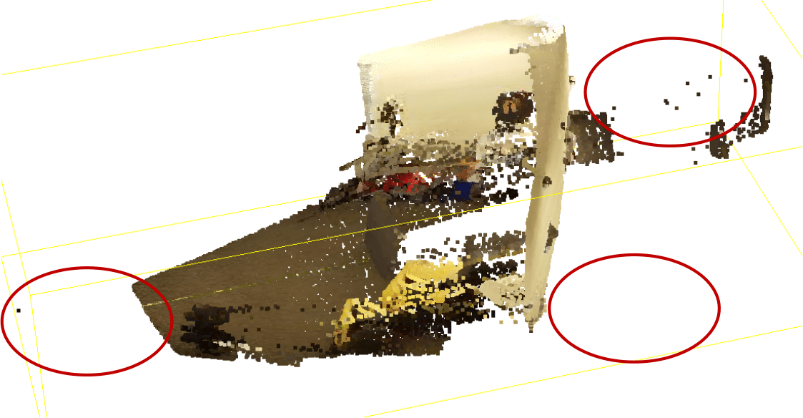
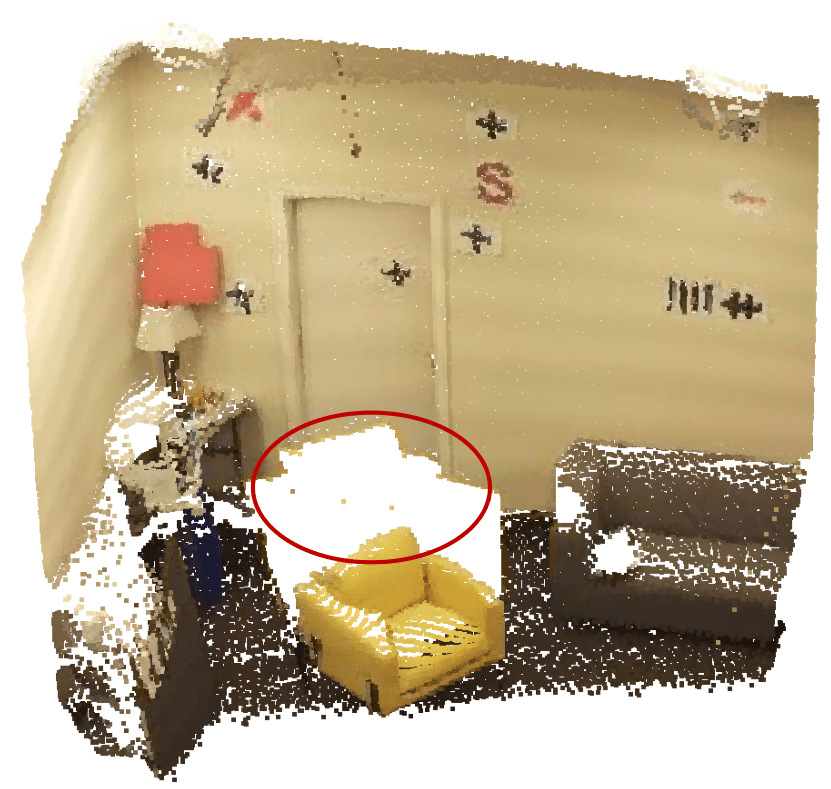

# Color-Guided Flying Pixel Correction In Depth Images

We propose a flying pixel correction method using the aligned high resolution RGB data.



Flying Pixels are a common phenomenon that occurs within RGB+D data. 



## Download and Install

For installation, Matlab R2023a or later is required. In addition to this, the following repository of Oyla data is required (https://github.com/ekamresh/oyla_datasets)

### Download this repository

Change directory to `~/Downloads`.
```
cd ~/Downloads
```

Clone both repositories from GitHub.
```
git clone https://github.com/STAC-USC/Color_Guided_Flying_Pixel_Correction_in_Depth_Images.git

```

```
git clone https://github.com/ekamresh/oyla_datasets.git
```

Change directory to that of the downloaded repository.
```
cd Color_Guided_Flying_Pixel_Correction_in_Depth_Images
```

## Run the algorithm

Start matlab.
```
matlab &
```

After changing the relative paths to point to the Oyla dataset, run the file main.m. No other inputs are required. 

```
main.m
```

## View results
After running our correction algorithm on the data, you can visualize the corrected point clouds. 

There should be a visible difference in the number of flying pixels within the images.

| {width=250} | {width=250} | {width=250} |
| --- | --- | --- |
| {width=250} | {width=250} | {width=250} |


# Support this work

If you find the algorithm presented in this repository useful or have any technical feedback, feel free to contact the [corresponding author](evasudev@usc.edu). If you use this software towards your research, cite [this paper](https://arxiv.org/abs/2410.08084). Thank you!

